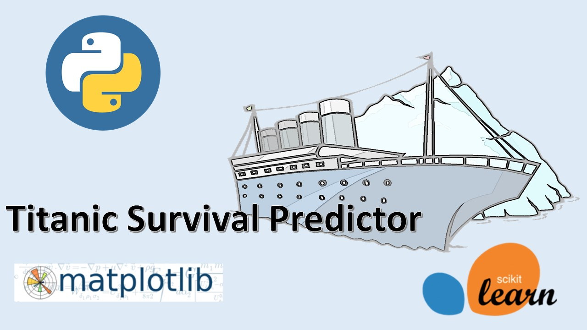
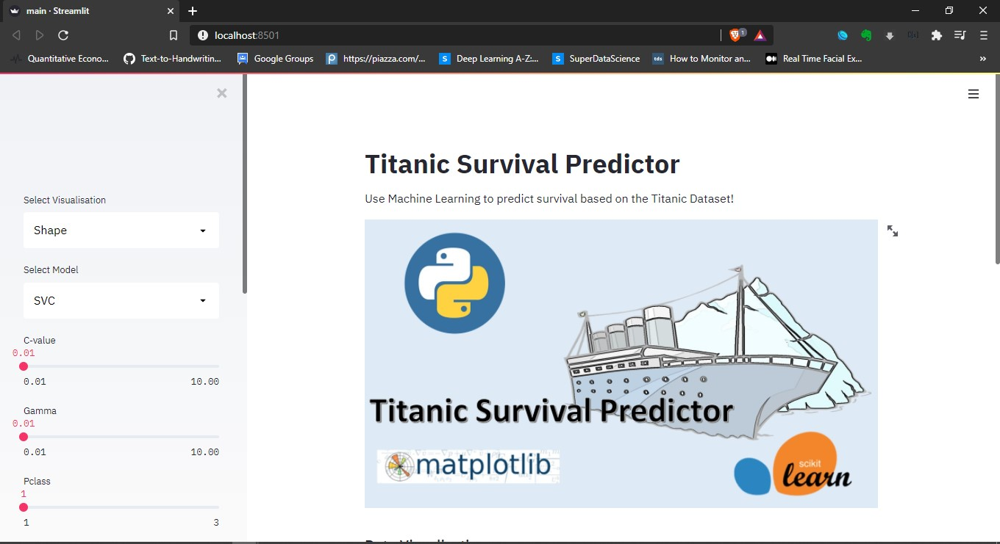

# Titanic Survival Predictor
Use Machine Learning to predict survival on the Titanic dataset!
Use three different ML classification metodologies to make the prediction

## Screenshots

##Demo

## Instructions
1. Download relevant dependacies by : pip install requirements.txt
2. To run the web service, type streamlit run  diabetes_web_ap.py
3. Select the URL to access the web app